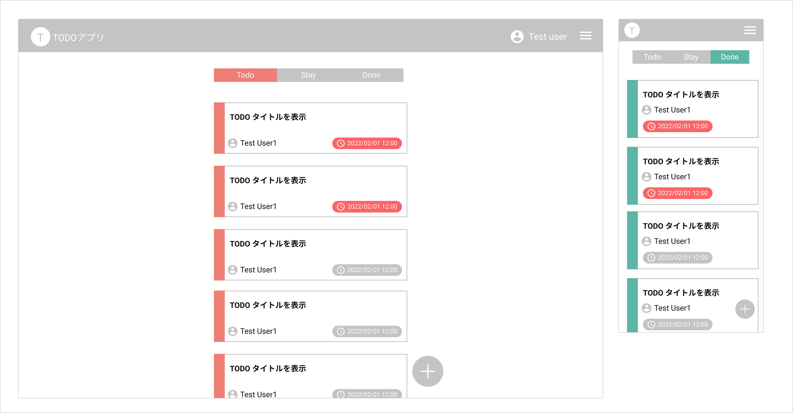

# Todo-Scratch

招待したユーザでグループを作成し、タスクを簡単に管理できるグループタスク管理アプリケーション

## アプリケーション構成

### バックエンドアプリ

- python でフルスクラッチで作成したバックエンドアプリライブラリ「[atom-bk-frame](https://github.com/Atom1116/atom-bk-frame)」を利用

### フロントエンド

- フロントエンドアプリケーションフレームワーク「[React](https://ja.reactjs.org/)」を利用

## Todo-Scratch 機能概要

- タスク作成・管理
  - タスクを作成し、アプリケーション上で閲覧、検索、削除ができます。
- グループ作成・招待
  - グループを作成し、参加させる家族、友人を招待・追加することができます。
- グループ内タスク共有
  - 作成したグループ内でタスクを共有し、管理することができます。
- タスクのステータス管理機能
  - タスクに状態（ステータス）を持たせ、進捗を管理することができます。
- タスクへのコメント機能
  - タスクへコメントを投稿し、タスク内容の連絡や作業履歴を残すことができます。
- ユーザ認証機能
  - ユーザ認証の機能により、セキュリティを確保できます。

## プロジェクト構成

| フォルダ名   | 概要                                                              |
| ------------ | ----------------------------------------------------------------- |
| todo_scratch | アプリケーションのルートフォルダ                                  |
| □├bk_app     | Todo-Scratch アプリのバックエンドアプリケーションソースフォルダ   |
| □├fk_app     | Todo-Scratch アプリのフロントエンドアプリケーションソースフォルダ |
| document     | アプリケーションのドキュメント格納フォルダ                        |
| test         | テストコード格納フォルダ                                          |

## 設計ドキュメント

### bk_app

| Document                                               | 内容                                                   |
| ------------------------------------------------------ | ------------------------------------------------------ |
| [アプリ設計](./document/bk_app/bk_app_design.md)       | バックエンドアプリの概要設計書                         |
| [WebAPI 仕様書](./document/bk_app/api_design.md)       | バックエンドアプリの WebAPI 仕様を記載した仕様書       |
| [テーブル定義書](./document/bk_app/db/table_design.md) | バックエンドアプリの DB テーブルの定義を記載した定義書 |

### fk_app

| Document                                         | 内容                             |
| ------------------------------------------------ | -------------------------------- |
| [アプリ設計](./document/fk_app/fk_app_design.md) | フロントエンドアプリの概要設計書 |
