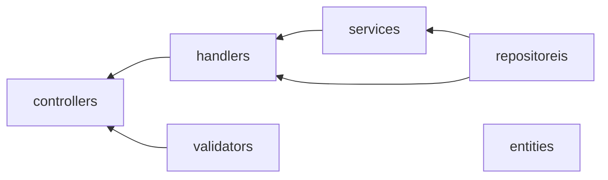

# [bk_app] Todo-Scratch バックエンドアプリケーション 仕様書

Todo-Scratch アプリのバックエンドアプリケーション。  
バックエンドアプリの機能仕様については、[WebAPI 仕様書](./api_design.md)を参照。  
Todo-Scratch のアプリの仕様は、[こちら][.]を参照。

## python バージョン

- python: v3.9.0 ~

## WebAPI 仕様

https://github.com/Atom1116/todo-scratch/blob/develop/document/bk_app/api_design.md

## フォルダ構成

| フォルダ     | 内容                                                                   |
| ------------ | ---------------------------------------------------------------------- |
| controllers  |                                                                        |
| handlers     | Contoroller のロジック処理を扱うファイルを格納                         |
| validators   | Controller のリクエストパラメータ等のチェック処理を扱うファイルを格納  |
| entities     | アプリケーションのモデルオブジェクトを表現する Entity ファイルを格納。 |
| repositoreis | 永続化処理を扱うファイルを格納                                         |
| services     | アプリケーションのモデルを操作する処理を扱うファイルを格納             |

## 依存関係

