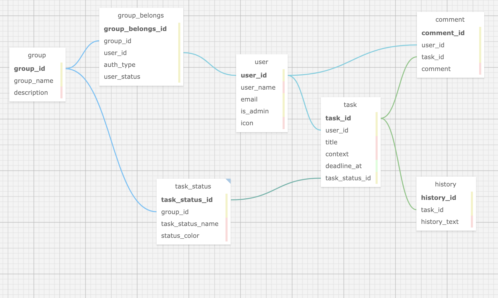

Todo-Scratch テーブル設計

## テーブル一覧

| 名称                            | 概要                 |
| ------------------------------- | -------------------- |
| [user](#user)                   | ユーザ               |
| [group](#group)                 | グループ             |
| [group_belongs](#group_belongs) | グループ所属情報     |
| [task_status](#task_status)     | タスクの状態マスタ   |
| [task](#task)                   | タスク               |
| [comment](#comment)             | タスクのコメント管理 |
| [hisotry](#hisotry)             | タスクの履歴情報管理 |

---

## テーブル詳細

### user

アカウント情報を管理

| 列名       | 型       | 内容                 |
| ---------- | -------- | -------------------- |
| user_id    | INT      | ユーザ ID 主キー     |
| user_name  | VARCHAR  | ユーザ名             |
| email      | VARCHAR  | メールアドレス       |
| is_admin   | BOOLEAN  | システム管理者フラグ |
| icon       | VARCHAR  | アイコンイメージ管理 |
| created_at | DATETIME | 作成日時             |
| updated_at | DATETIME | 更新日時             |

### group

グループ情報を管理

| 列名        | 型       | 内容               |
| ----------- | -------- | ------------------ |
| group_id    | INT      | グループ ID 主キー |
| group_name  | VARCHAR  | グループ名         |
| description | VARCHAR  | グループ説明       |
| created_at  | DATETIME | 作成日時           |
| updated_at  | DATETIME | 更新日時           |

### group_belongs

グループの所属情報を管理

| 列名             | 型       | 内容                                             |
| ---------------- | -------- | ------------------------------------------------ |
| group_belongs_id | INT      | 主キー                                           |
| group_id         | INT      | グループ ID                                      |
| user_id          | INT      | ユーザ ID                                        |
| auth_type        | INT      | ユーザのグループ権限種別 0:ホストユーザ 1:ユーザ |
| user_status      | INT      | ユーザのグループの所属状態 0:承認待ち 1:参加済み |
| created_at       | DATETIME | 作成日時                                         |
| updated_at       | DATETIME | 更新日時                                         |

### task_status

タスク状態マスタ

| 列名             | 型       | 内容             |
| ---------------- | -------- | ---------------- |
| task_status_id   | INT      | タスク ID 主キー |
| group_id         | INT      | グループ ID      |
| task_status_name | VARCHAR  | タスク状態名     |
| status_color     | VARCHAR  | 状態色           |
| created_at       | DATETIME | 作成日時         |
| updated_at       | DATETIME | 更新日時         |

### task

タスク情報を管理

| 列名           | 型       | 内容                |
| -------------- | -------- | ------------------- |
| task_id        | INT      | タスク ID 主キー    |
| user_id        | INT      | ユーザ ID           |
| title          | VARCHAR  | タスクタイトル      |
| context        | VARCHAR  | タスク内容          |
| deatline_at    | DATETIME | 期限日時            |
| task_status_id | INT      | タスクステータス ID |
| created_at     | DATETIME | 作成日時            |
| updated_at     | DATETIME | 更新日時            |

### comment

タスクのコメント管理

| 列名       | 型       | 内容             |
| ---------- | -------- | ---------------- |
| comment_id | INT      | タスク ID 主キー |
| user_id    | INT      | ユーザ ID        |
| task_id    | INT      | タスク ID        |
| comment    | VARCHAR  | コメント         |
| created_at | DATETIME | 作成日時         |
| updated_at | DATETIME | 更新日時         |

### history

タスクの履歴管理

| 列名         | 型       | 内容             |
| ------------ | -------- | ---------------- |
| history_id   | INT      | タスク ID 主キー |
| task_id      | INT      | タスク ID        |
| history_text | VARCHAR  | 履歴テキスト     |
| created_at   | DATETIME | 作成日時         |
| updated_at   | DATETIME | 更新日時         |
