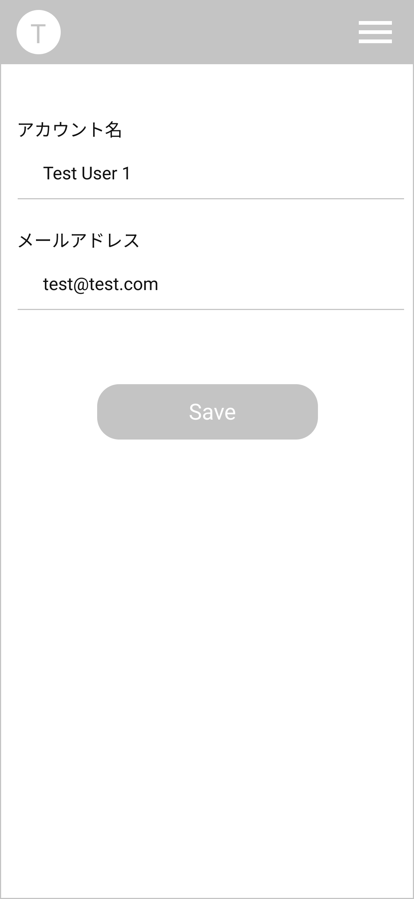

# AccountPage Page アカウント画面

## 画面

## 画面機能概要

- ユーザアカウントを表示・編集する画面

## 利用 WebAPI

| API 名                                                              | エンドポイント | メソッド | 認証 | 概要                       | カテゴリ |
| ------------------------------------------------------------------- | -------------- | -------- | ---- | -------------------------- | -------- |
| [アカウント情報編集](../../bk_app/api_design.md#アカウント情報編集) | /account       | PUT      | 有   | ユーザアカウント情報の編集 | 認証     |

## イベント処理

1. 初期化処理
   - Context に保存されたユーザ情報をフィールドへ設定する
2. 保存処理

   - 「Save」ボタン押下

   - バリデーション処理を実行。バリデーションチェックにてチェック範囲外の場合、メッセージを表示し以降の処理はなし
     - アカウント名の空白 orNull チェック
     - パスワードの空白 orNull チェック
   - API.アカウント情報編集を発火
   - 編集したユーザ情報を Context へ保存する
