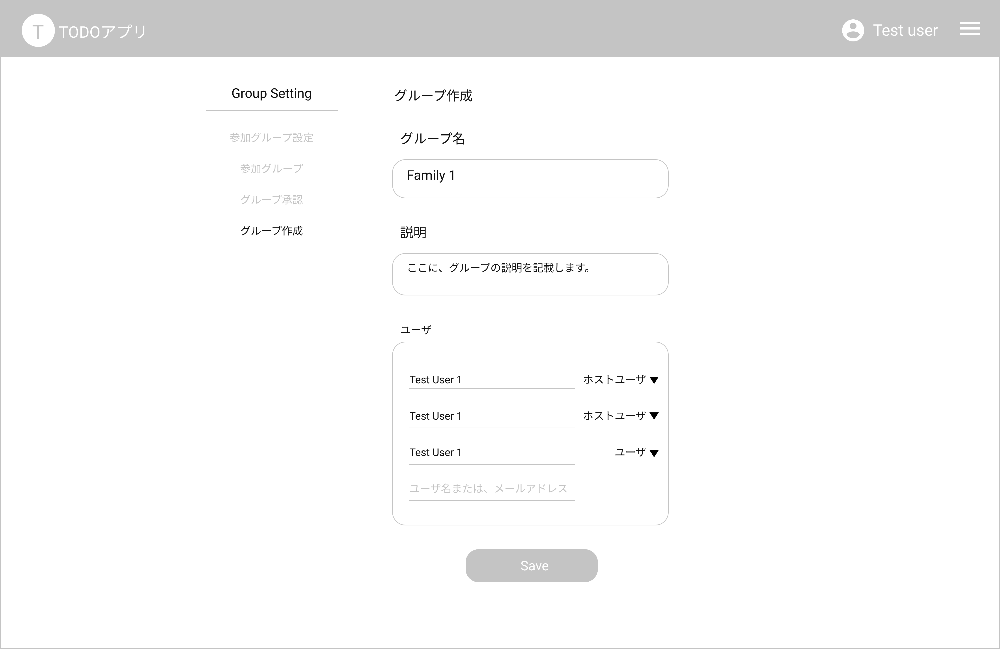
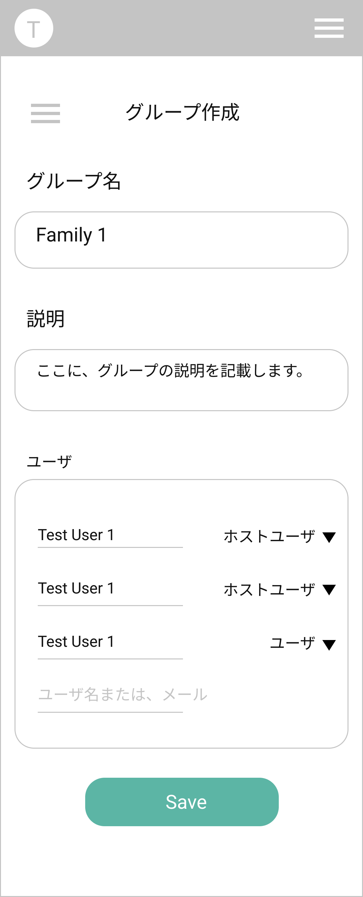

# GroupCreate Page 新規グループ作成画面

## 画面

## 画面機能概要

- グループを新規作成する画面

## 利用 WebAPI

| API 名                                                          | エンドポイント | メソッド | 認証 | 概要             | カテゴリ     |
| --------------------------------------------------------------- | -------------- | -------- | ---- | ---------------- | ------------ |
| [グループ新規作成](../../bk_app/api_design.md#グループ新規作成) | /group         | POST     | 有   | グループ新規作成 | グループ管理 |

## イベント処理

1. 初期化処理
   - なし
2. グループ作成処理

   - バリデーション処理を実行。バリデーションチェックにてチェック範囲外の場合、メッセージを表示し以降の処理はなし

     - グループ名、説明の空白 orNull チェック

   - API.グループ作成を発火
   - エラーした場合、グループ作成が失敗したメッセージを表示
   - 成功した場合、作成したグループを選択済みグループとして Context へ設定し、グループ設定画面へ遷移する(/group-setting)
