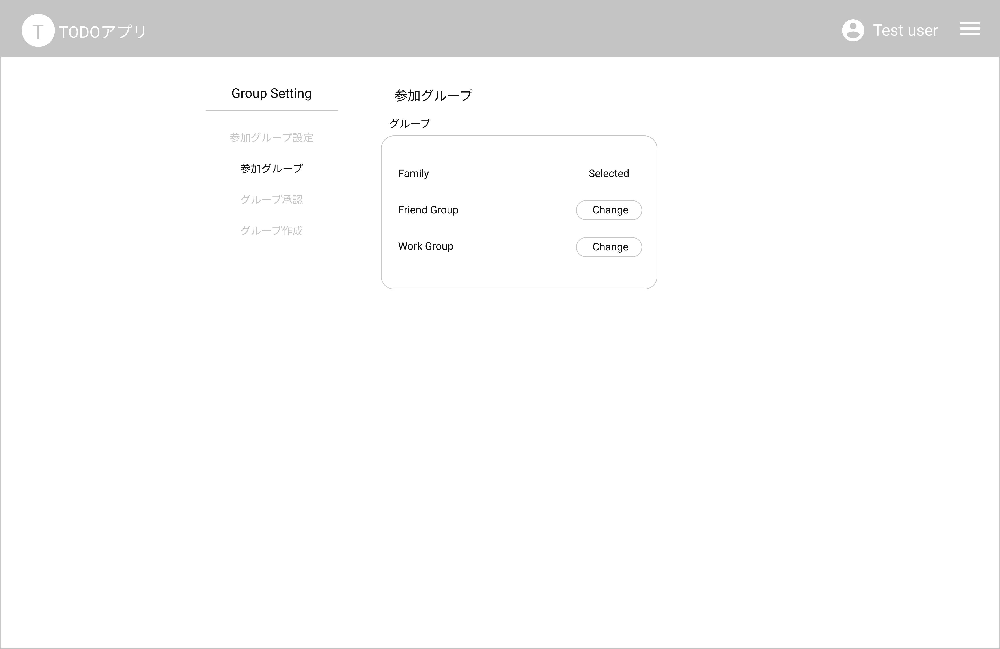

# GroupJoinedList Page 参加グループ一覧

## 画面

## 画面機能概要

- ユーザが参加するグループの一覧表示・選択画面

## 利用 WebAPI

| API 名                                    | エンドポイント | メソッド | 認証 | 概要                 | カテゴリ     |
| ----------------------------------------- | -------------- | -------- | ---- | -------------------- | ------------ |
| [参加済みグループ取得](#参加済みグループ) | /group/joined  | GET      | 有   | 参加済みグループ取得 | グループ管理 |

## イベント処理

1. 初期化処理
   - API.参加済みグループ取得を発火
   - 取得したグループ一覧を画面へ表示
   - 取得件数が０件の場合、参加済みグループがないメッセージを表示
   - Context に保存した選択済みグループと一致したグループがある場合、「Selected」と表示
2. 選択済みグループ変更
   - 一覧行の「Change」ボタンを押下
   - 押下した行のグループを選択済みグループとして Context へ保存する
   - グループ設定画面へ遷移する(/group-setting)
