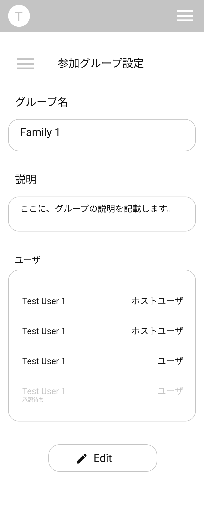

# GroupSetting Page 　グループ設定画面

## 画面

## 画面機能概要

- グループ情報を表示・編集する画面

## 利用 WebAPI

| API 名                                | エンドポイント    | メソッド | 認証 | 概要             | カテゴリ     |
| ------------------------------------- | ----------------- | -------- | ---- | ---------------- | ------------ |
| [グループ情報取得](#グループ情報取得) | /group/{group_id} | GET      | 有   | グループ情報取得 | グループ管理 |
| [グループ情報更新](#グループ情報更新) | /group/{group_id} | PUT      | 有   | グループ情報更新 | グループ管理 |

## モード

1. 表示モード
2. 編集モード([新規グループ作成画面](./group_create_design.md)と同様)

## イベント処理

1. 初期化処理

   - 表示モード
     - 画面の初期化時のモード
     - API.グループ情報取得を発火しグループ情報を取得
     - 取得したグループ情報を画面へ設定
       - ユーザ一覧の表示； user.auth_type により「0」⇨「ホストユーザ」「1」⇨「ユーザ」と表示
       - 「Edit」ボタンの表示有無：ログインユーザがグループの「ホストユーザ」の場合、表示
   - 編集モード
     - グループ設定画面の Context へ保存したグループ情報を入力フォームへ設定

2. モード切り替え

   - 表示モード時

     - 「Edit」ボタン押下

   - 編集モード時
     - 「Back」ボタン押下

3. グループ編集処理（編集モード時）
   - 「Save」ボタン押下
   - バリデーション処理を実行。バリデーションチェックにてチェック範囲外の場合、メッセージを表示し以降の処理はなし
     - グループ名、説明の空白 orNull チェック
   - API.グループ情報更新を発火
   - API がエラーした場合、エラーした旨をメッセージで表示
   - 成功した場合、グループ設定画面の Context のグループ情報を更新し、表示モードへ移る
