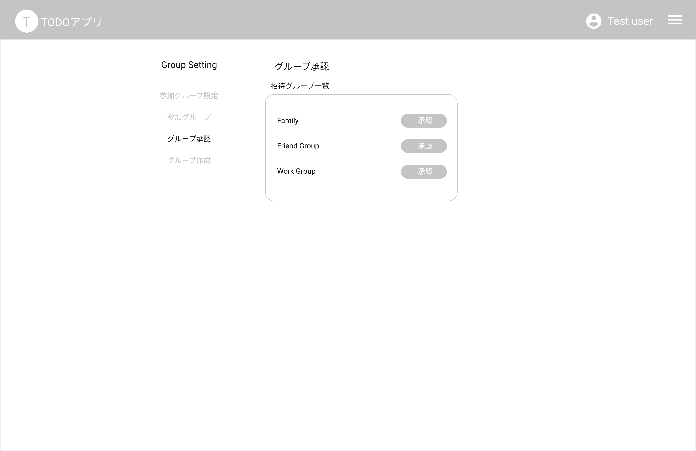

# GroupApproveList Page 招待グループ一覧

## 画面

## 画面機能概要

- ユーザが招待されたグループを一覧表示・承認する画面

## 利用 WebAPI

| API 名                                        | エンドポイント          | メソッド | 認証 | 概要                 | カテゴリ     |
| --------------------------------------------- | ----------------------- | -------- | ---- | -------------------- | ------------ |
| [承認依頼グループ一覧](#承認依頼グループ一覧) | /group/approval-request | GET      | 有   | 承認依頼グループ一覧 | グループ管理 |
| [グループ参加承認](#グループ参加承認)         | /group/approval-request | POST     | 有   | グループ参加承認     | グループ管理 |

## イベント処理

1. 初期化処理

   - API.承認依頼グループ一覧を発火
   - 取得したデータより画面表示処理を実施

2. グループ承認処理
   - 一覧行の「承認」ボタン押下
   - 選択したグループの ID をキーとして API.グループ参加承認を発火
   - 選択したグループを Context の選択済みグループと保存する
   - グループ設定画面へ遷移(/group-setting)
