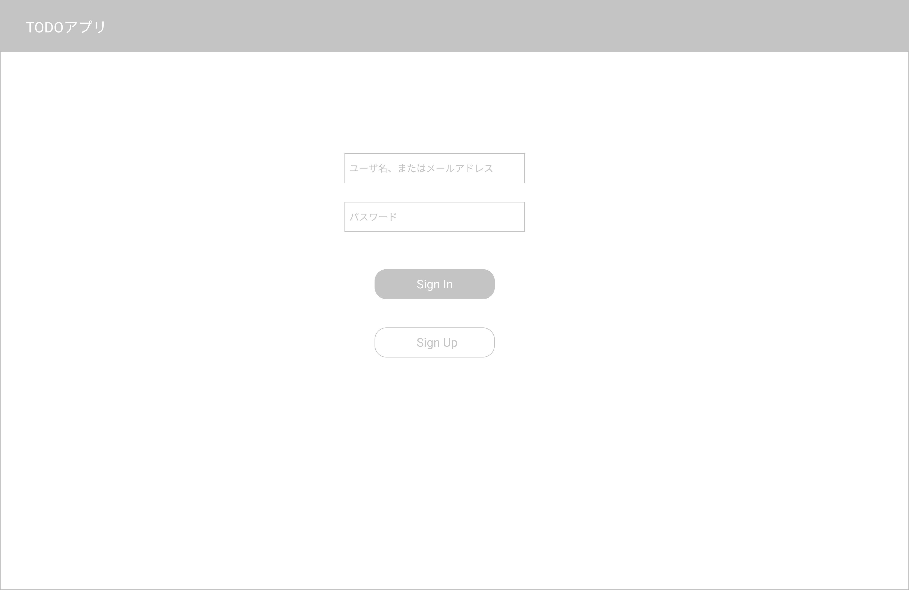
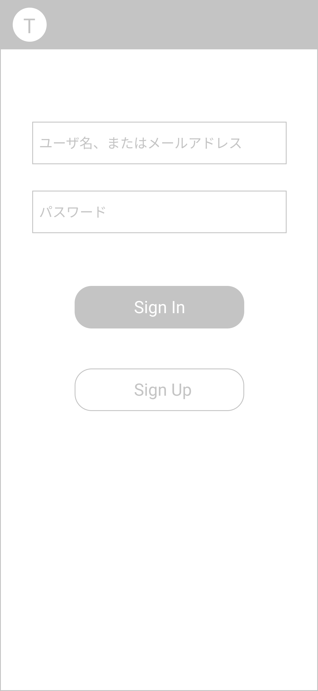

# SignIn Page サインイン画面

## 画面

## 画面機能概要

- Todo-Scrach アプリのサインイン画面

## 利用 WebAPI

| API 名                                                      | エンドポイント | メソッド | 認証 | 概要                                   | カテゴリ |
| ----------------------------------------------------------- | -------------- | -------- | ---- | -------------------------------------- | -------- |
| [ユーザログイン](../../bk_app/api_design.md#ユーザログイン) | /signin        | POST     | 無   | システムログイン。セッション ID を取得 | 認証     |

## イベント処理

1. 初期化処理
   サインイン済みか判定。サインイン済みの場合、タスクリスト画面へ遷移(/)

2. サインイン処理

   - 「SignIn」ボタン押下
   - バリデーション処理を実行。バリデーションチェックにてチェック範囲外の場合、メッセージを表示し以降の処理はなし
     - ユーザ名、またはメールアドレステキストフィールドの空白 orNull チェック
     - パスワードの空白 orNull チェック
   - API.ユーザログインを発火
   - ユーザ情報を Context へ保存し、タスク一覧画面へ遷移(/)

3. ユーザ登録画面遷移
   - 「SignUp」ボタン押下
   - ユーザ登録画面(/signup)へ遷移
