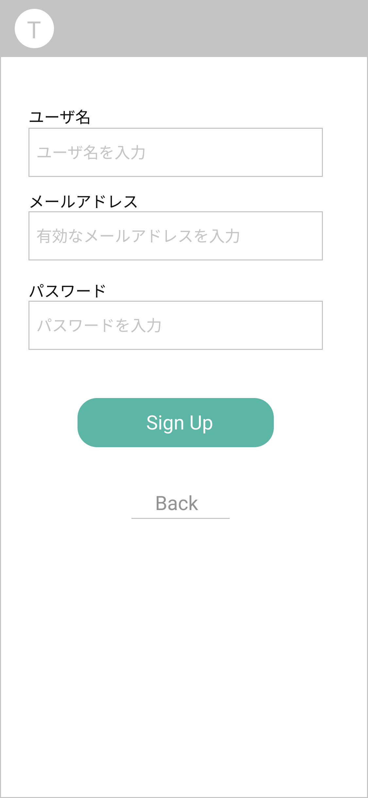

# SignUp Page ユーザ登録画面

## 画面

## 画面機能概要

- Todo-Scrach アプリのユーザ登録画面

## 利用 WebAPI

| API 名                            | エンドポイント | メソッド | 認証 | 概要           | カテゴリ |
| --------------------------------- | -------------- | -------- | ---- | -------------- | -------- |
| [ユーザ新規作成](#ユーザ新規作成) | /signup        | POST     | 無   | 新規ユーザ登録 | 認証     |

## イベント処理

1. 初期化処理

   - なし

2. サインアップ処理

   - 「SignUp」ボタン押下
   - バリデーション処理を実行。バリデーションチェックにてチェック範囲外の場合、メッセージを表示し以降の処理はなし
     - テキストフィールドの空白 orNull チェック
     - メールアドレスの有効性チェック
   - WebAPI.ユーザ新規登録を発火
   - サインイン画面へ戻る(/signin)

3. 戻る処理
   - 「Back」ボタン押下
   - サインイン画面(/signin)へ遷移
