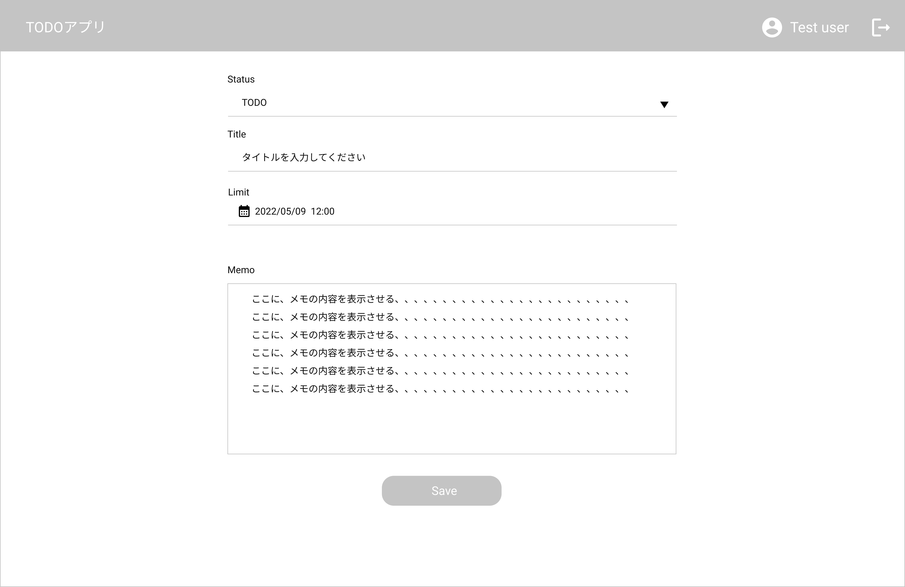
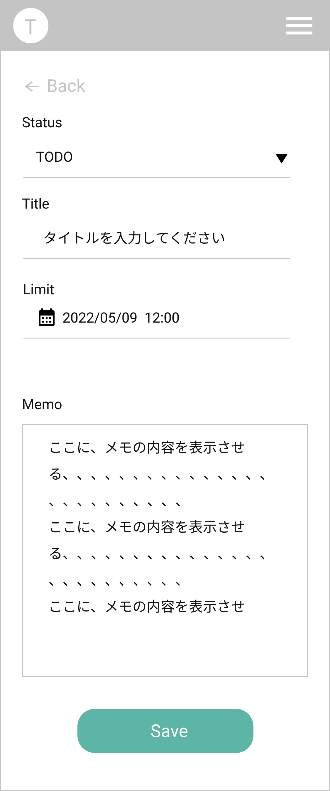

# TaskCreate Page タスク作成画面

## 画面

- タスク詳細画面
  
  

## 画面機能概要

- 新規タスクの作成を行う画面

## 利用 WebAPI

| API 名                            | エンドポイント         | メソッド | 認証 | 概要           | カテゴリ |
| --------------------------------- | ---------------------- | -------- | ---- | -------------- | -------- |
| [タスク新規作成](#タスク新規作成) | /group/{group_id}/task | POST     | 有   | タスク新規作成 | アプリ   |

## イベント処理

1. 初期化処理

   - タスクステータス DDL
     - Context へ保存されたタスクステータス情報に基づきドロップダウンを作成・表示

2. タスク新規作成処理
   - 「Save」ボタン押下
   - バリデーション処理を実行。バリデーションチェックにてチェック範囲外の場合、メッセージを表示し以降の処理はなし
     - 入力フィールドの空白 orNull チェック
   - API.タスク新規作成を発火
   - エラーした場合、その旨をメッセージで表示
   - 成功した場合、タスク一覧画面へ遷移(/)
