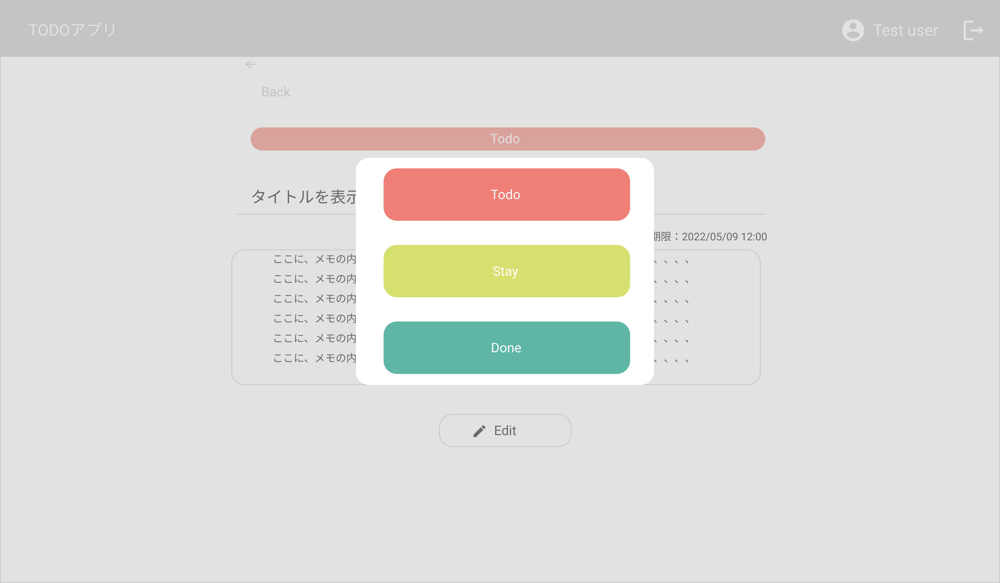

# TaskDetail Page タスク詳細・編集画面

## 画面

- タスク詳細画面
  
  
  

## 画面機能概要

- 登録したタスクの詳細表示・編集を行う画面

## 利用 WebAPI

| API 名                                        | エンドポイント                                 | メソッド | 認証 | 概要                 | カテゴリ |
| --------------------------------------------- | ---------------------------------------------- | -------- | ---- | -------------------- | -------- |
| [タスク詳細情報取得](#タスク詳細情報取得)     | /group/{group_id}/task/{task_id}/detail        | GET      | 有   | タスク詳細情報取得   | アプリ   |
| [タスク更新](#タスク更新)                     | /group/{group_id}/task/{task_id}               | PUT      | 有   | タスク更新           | アプリ   |
| [タスクステータス変更](#タスクステータス変更) | /group/{group_id}/task/{task_id}/change-status | PUT      | 有   | タスクステータス変更 | アプリ   |

## モード

1. 表示モード
2. 編集モード([タスク作成画面](./task_create_design.md)と同様)

## イベント処理

1. 初期化処理

   - モード共通

     - タスク詳細情報表示
       - URL パスのグループ ID,タスク ID より API.タスク詳細情報取得を発火
     - 取得したタスク

   - 表示モード
     - 画面の初期化時のモード
     - タスクステータスの表示
       - タスク情報のタスクステータスの ID に一致する Context に保存したタスクステータス情報の ID の名称・カラーを設定する
     - 表示するタスクの投稿ユーザがログインユーザの場合、「Edit」ボタンを表示
   - 編集モード
     - タスク詳細・編集画面の Context へ保存されたタスク情報を入力フォームへ設定する

2. モード切り替え

   - 表示モード時

     - 「Edit」ボタン押下

   - 編集モード時
     - 「Back」ボタン押下

3. タスクステータス変更ダイアログ表示（表示モード時）
   - タスクステータスエリアを押下
   - タスクステータス変更ダイアログを表示
4. タスクステータス変更処理(表示モード時)
   - タスクステータス変更ダイアログ表示時
   - 任意のタスクステータスカードを押下時
   - API.タスクステータス変更を発火
   - 成功した場合、タスク詳細・編集画面に保存したタスク情報を更新
5. タスク編集処理（編集モード時）
   - 「Save」ボタン押下
   - バリデーション処理を実行。バリデーションチェックにてチェック範囲外の場合、メッセージを表示し以降の処理はなし
     - 入力フォームの空白 orNull チェック
   - API.タスク更新を発火
   - API がエラーした場合、エラーした旨をメッセージで表示
   - 成功した場合、タスク詳細・編集画面の Context のタスク情報を更新し、表示モードへ移る
