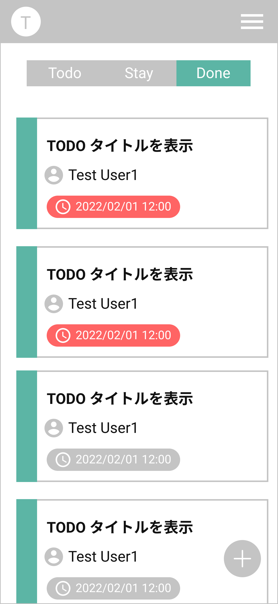

# TaskList Page タスク一覧画面

## 画面

## 画面機能概要

- 登録したタスク一覧表示画面

## 利用 WebAPI

| API 名                                                | エンドポイント                     | メソッド | 認証 | 概要                     | カテゴリ |
| ----------------------------------------------------- | ---------------------------------- | -------- | ---- | ------------------------ | -------- |
| [タスク一覧取得](#タスク一覧取得)                     | /group/{group_id}/task             | GET      | 有   | タスク一覧取得           | アプリ   |
| [タスクステータス情報取得](#タスクステータス情報取得) | /group/{group_id}/task/status-info | GET      | 有   | タスクステータス情報取得 | アプリ   |

## イベント処理

1. 初期化処理

   - タスクステータス情報からタブ作成
     　- Context に保存したタスクステータス情報からタブを作成
     　- タスク名称・色を設定する

   - タスク一覧取得
     - API.タスク一覧取得を発火
     - 取得したデータを画面へ表示
     - タスクデータのタスクステータス ID ごとに、タブを分ける
     - カードカラーはタスクステータス ID に紐づくカラーを表示
     - 期限日時が現在時刻より過去出会った場合、赤く表示する

2. タスク詳細画面遷移

   - タスクカードを押下
   - 押下したタスク ID を URL パスへ埋め込み、タスク詳細画面へ遷移（/group/{グループ ID}/task/{タスク ID}）

3. タスク作成画面遷移
   - タスク追加フロートボタン押下
   - タスク新規作成画面へ遷移(/task/create)

## TODO

- 検索機能
  - API.タスク一覧取得には検索機能もあるため、それを使用した検索機能を実装
