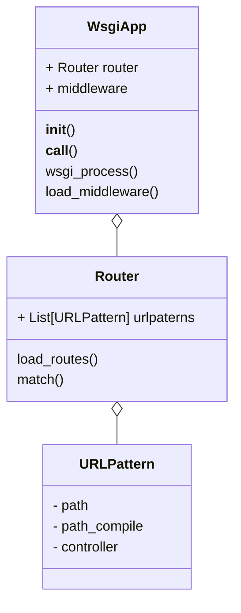
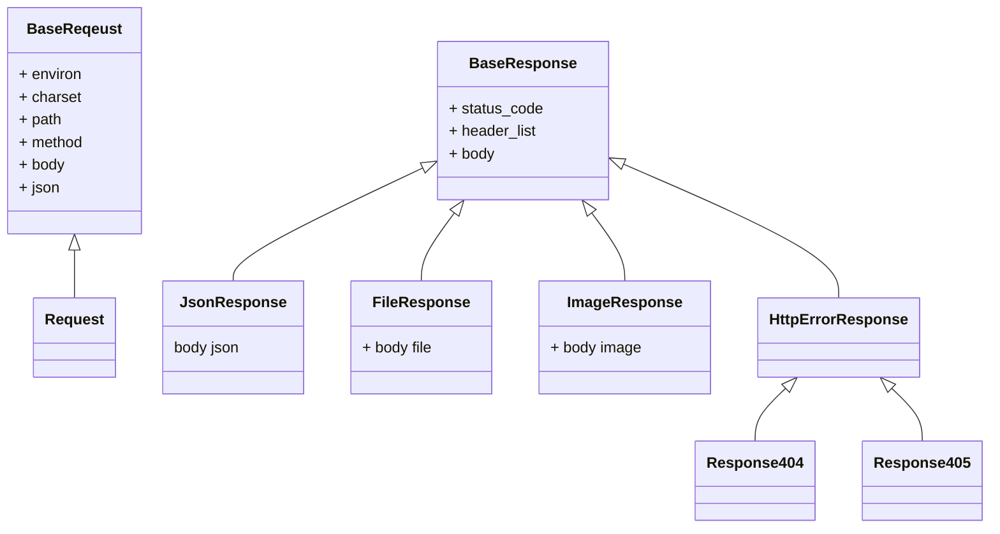
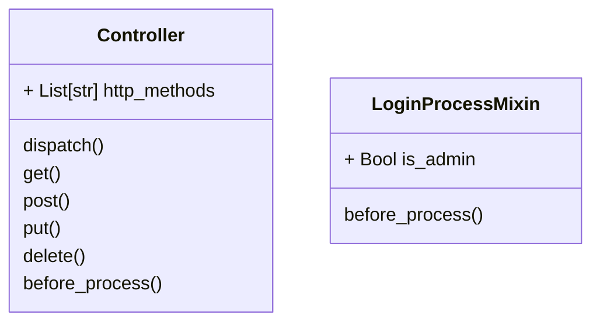

# バックエンドアプリ ベース設計

TODO-SCRATCH アプリのバックエンドアプリケーションのベースソースの設計書

## フォルダ構成

## フォルダ概要

| フォルダ名 | 概要                                                   |
| ---------- | ------------------------------------------------------ |
| core       | アプリケーションのメイン処理ファイルを格納             |
| http       | HTTP にまつわる処理ファイルを格納                      |
| controller | アプリケーションの処理操作を管理する処理ファイルを格納 |
| middleware | ミドルウェア処理にまつわる処理ファイルを格納           |
| db         | DB 処理ファイルを格納                                  |
| util       | プロジェクト全体で使用する処理ファイルを格納           |
| gunicorn   | 「Gunicorn」を使用した Web サーバ処理ファイルを格納    |

### app

- app
  - アプリケーションの起動、メインの処理を持つ
  - 適切な callback とその引数を検索する。
  - controller
    - Response を生成する callback を作る。callback の引数も生成する。
  - とりあえずすべての HTTP メソッドを返せる、BaseController を作る。(Json は JsonResponse を返すようにする。)
  - Controller を派生する意味は今のところないかもしれない。（Django のようにモデルに紐づいて UPDATE とかを楽に実装するとかがなければ）
  - Django っぽいけど気にしない。
  - AuthMixin を作り、認証処理を実装する。引数を作る処理に入れ込みたいかな。

## 構成別設計

### core

- app
  アプリケーションのメインの処理。WSGI アプリケーションの仕様に準拠する。
- router
  リクエスト情報から、該当する処理クラスを照合する。

#### クラス図

### http

### controller

### db
